# Golang

## 一.开始

### 1 Go环境安装

#### 1.1 Go编译器下载

官网 https://golang.google.cn/

#### 1.2 配置环境变量 

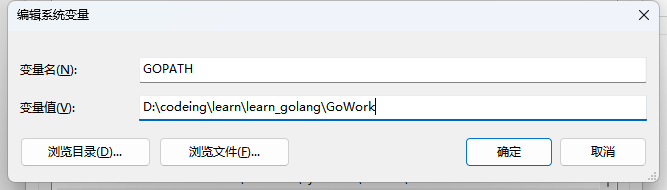

在该文件夹下 创建 三个文件夹

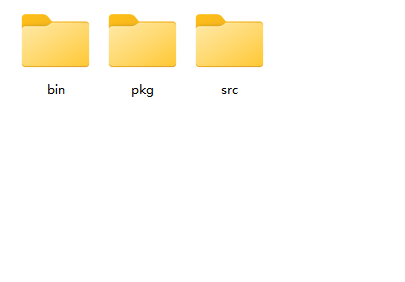

#### 1.3 hello word

在任意位置，创建一个文件  hello/main.go

```go
package main

import "fmt"

func main()  {
	fmt.Println("hello word")
}
```

然后对文件进行编译 

在当前文件夹打开cmd

```
方法1：
go build mian.go
方法2：
go build
方法3：
go build -o 别名
```

上述方法会生成一个可执行文件

执行 `go run mian.go`  可以编译并执行


#### 1.4 goland 安装

官网 [Download GoLand: A Go IDE with extended support for JavaScript, TypeScript, and databases (jetbrains.com)](https://www.jetbrains.com/go/download/#section=windows)


#### 1.5 创建项目

在之前配置的环境变量文件夹中的 src 下创建项目 learn

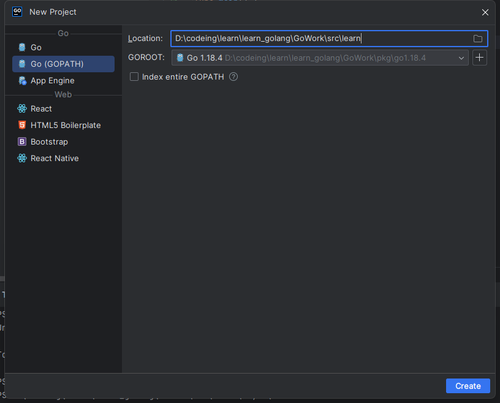

新建文件 day01/01helloworld/main.go

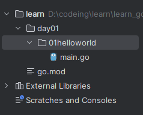

```
package main

import "fmt"

func main() {
	fmt.Println("hello world!")
}
```

在01helloworld文件夹下 打开 编译器终端执行  go build

正常执行则会生成 一个后缀为.exe 的文件

如果报错 检查 系统环境变量和用户环境变量 中的 GOPATH

还要修改编译器的设置

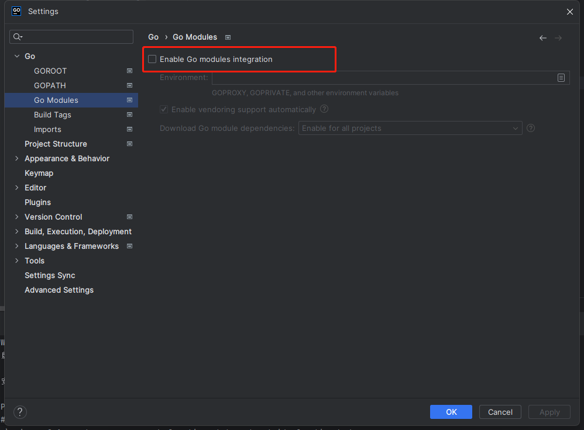

还需要关闭  go mod 模式

```
go env -w GO111MODULE=off
```


想要执行还可以直接使用编辑器

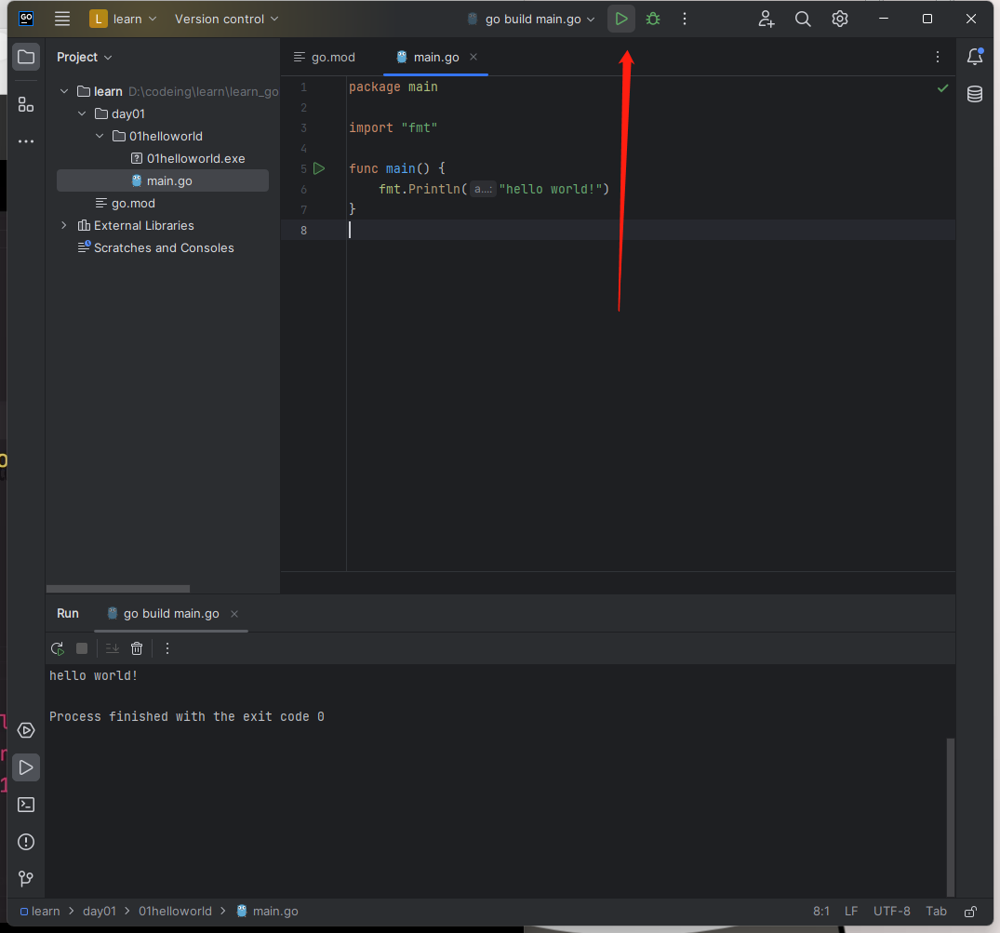


## 二.基础语法

### 1.注释

```go
//单行注释

/*
	多
	行
	注
	释
*/
```

### 2.变量

```
var 变量名 变量类型

var x int
var s string
var b bool
```

```go
package main

import "fmt"

func main() {
	// 声明变量  var 变量名 类型

	var age int //声明未赋值，默认 零 值
	fmt.Println(age)
	age = 22
	fmt.Println(age)
	age = 30
	fmt.Println(age)

	// 声明并赋值一行实现
	var name string = "张三"
	fmt.Println(name)

	// 声明并赋值的简洁写法  只能在函数内部使用 全局变量不能用这种写法
	name2 := "李四"
	fmt.Println(name2)

	// 一行声明多个变量
	var x, y int
	fmt.Println(x, y)

	var (
		a int    // 默认值 0
		b string // 默认值 空字符串
		c bool   // 默认值 false
	)
	fmt.Println(a, b, c)

	// 一行声明赋值多个变量

	//var o, p, q = "o", "p", "q"
	o, p, q := "o", "p", "q"

	fmt.Println(o, p, q)
}
```

### 3.值拷贝

```go
package main

import "fmt"

func main() {
	var x = 10
	var y = x  //值拷贝  x,y对应的是完全不同的地址空间
	x = 20
	fmt.Println(x, y)

	var a = 1 + 1
	fmt.Println(a)

	var b = x * y
	fmt.Println(b)
}
```

### 4.匿名变量

```go
package main

import "fmt"

func main() {
	//var a, _ = 1, 2 // _ 为匿名变量
	//fmt.Println(a)

	var a, _ = foo()
	fmt.Println(a)
}

// 当一个函数返回多个值的时候，而我们只需要其中部分值，不要的值可以用匿名变量
func foo() (int, int) {
	return 1, 2
}
```

### 5.语句分隔符

```go
package main

import "fmt"

func main() {
	// ; 和 换行 作为语句分隔符
	// 推荐换行作为分隔符
	var x = 100
	var y = 200
	fmt.Println(x, y)
}
```

### 6.基本数据类型

#### 6.1 整型和浮点型

```go
package main

import (
	"fmt"
	"reflect"
)

func main() {

	// 1.整型  int

	/*
	 int8：一个字节 范围 [-127 ~ 128]   2的8次方
	 ...
	*/
	var x int8 = 100
	fmt.Println(x)
	//x = 200 超出范围报错

	// 2.浮点型
	var f1 float32 = 3.012345678912345678
	var f2 float64 = 3.012345678912345678
	fmt.Println(f1)                 //3.0123458
	fmt.Println(reflect.TypeOf(f1)) //float32
	fmt.Println(f2)                 //3.0123456789123457
	fmt.Println(reflect.TypeOf(f2)) //float64

}
```

#### 6.2 布尔类型

```go
package main

import "fmt"

func main() {
	//布尔类型
	var b bool
	b = true
	b = false
	fmt.Println(b)

	fmt.Println(2 > 1)
}
```

#### 6.3 字符串类型

```go
package main

import "fmt"

func main() {
	// 字符串是最基本也是最常用的数据类型，是通过 双引号 将多个字符串联起来的一种数据，用于展示文本

	var s string //默认为 ""
	s = "hello world"
	fmt.Println(s)

	// 索引和切片 字符串[索引] 字符串[索引start:end] 左闭右开
	fmt.Println(string(s[1]))

	fmt.Println(s[1:3])
	fmt.Println(s[:7])
	fmt.Println(s[7:])

	// 字符串拼接
	var s1 = "Hi"
	var s2 = " world"
	fmt.Println(s1 + s2)

	// 转义符号
	fmt.Println("Hi\nworld")

	var s3 = "D:\\next\\go.exe"
	fmt.Println(s3) //  D:\next\go.exe

	var s4 = "his name is \"Bob\""
	fmt.Println(s4)

	// 多行打印
	fmt.Println("1.购买血药")
	fmt.Println("2.购买武器")
	fmt.Println("3.生命值槽")

	fmt.Println(`
	1.购买血药
	2.购买武器
	3.生命值槽
    `)
}
```

### 7.string包

```go
package main

import (
    "fmt"
    "strings"
)

func main() {
    var name = "Nash"
    var newName = strings.ToUpper(name)
    fmt.Println(name)
    fmt.Println(newName)
    fmt.Println(strings.ToLower(newName))

    var s = "rain rain"
    //  strings.HasPrefix() 判断以什么开头
    fmt.Println(strings.HasPrefix(s, "ra"))

    //  strings.HasSuffix() 判断以什么结尾
    fmt.Println(strings.HasSuffix(s, "in"))

    //  strings.Contains() 判断是否包含
    fmt.Println(strings.Contains(s, "iin"))

    // strings.Trim() 去除两端对应的字符
    var username = "   Nash   "
    fmt.Println(strings.Trim(username, " "))

    // strings.TrimLeft() 去除左边对应的字符
    fmt.Println(strings.TrimLeft(username, " "))

    // strings.TrimLeft() 去除右边对应的字符
    fmt.Println(strings.TrimRight(username, " "))

    // strings.TrimSpace() 去除两端空格
    fmt.Println(strings.TrimSpace(username))

    // index:索引
    var s2 = "hello world"
    fmt.Println(strings.Index(s2, "wo"))

    // 分割 拼接
    var s3 = "hello world hi Nash"
    var nameSlice = strings.Split(s3, " ")
    fmt.Println(nameSlice)
    fmt.Println(strings.Join(nameSlice, ""))
}
```

### 8.类型转换

```go
package main

import (
	"fmt"
	"reflect"
	"strconv"
)

func main() {
	// 整型之间的转换

	var x int8 = 100
	var y int16 = 200
	//fmt.Println(x + y)   //报错 无效运算: x + y(类型 int8 和 int16 不匹配)

	fmt.Println(x + int8(y)) // 结果变为44  超出范围 int8 范围[-127,128]

	fmt.Println(int16(x) + y)

	// 字符串与整型之间的转换
	// 字符串转整型
	var ageStr = "32"
	var age, _ = strconv.Atoi(ageStr)
	fmt.Println(age + 1)

	// 整型转字符串
	price := 100
	var priceStr = strconv.Itoa(price)
	fmt.Println(priceStr)

	// strconv Parse 系列函数
	// 将字符串转换成整型   bitSize 限制转换后值的范围
	var ret, _ = strconv.ParseInt("28", 10, 8)
	fmt.Println(ret, reflect.TypeOf(ret))

	// 将字符串转换成浮点型
	var ret1, _ = strconv.ParseFloat("3.1415926", 64)
	fmt.Println(ret1, reflect.TypeOf(ret1))

	// 将字符串转换成布尔值
	var b, _ = strconv.ParseBool("0")
	fmt.Println(b)
	var b1, _ = strconv.ParseBool("-1")
	fmt.Println(b1)
	var b2, _ = strconv.ParseBool("true")
	fmt.Println(b2)
	var b3, _ = strconv.ParseBool("T")
	fmt.Println(b3)
}
```


### 9.运算符

```
package main

import "fmt"

func main() {
	// 科学运算 + - * / %
	var x, y = 10, 20
	fmt.Println(x + y)
	fmt.Println(x - y)
	fmt.Println(x * y)
	fmt.Println(x / y)
	fmt.Println(x % y)

	// 关系运算符 > < == != >= <=
	fmt.Println(x > y)

	// 逻辑运算
	// 与运算 && 有假即假
	// 或运算 || 有真即真
	// 非运算 !  取反
	fmt.Println(true && false)
	fmt.Println(true || false)
	fmt.Println(!true || false)

	// 赋值运算   += -+ *= /+  ...
	var z = 10
	//z = z + 1 // 自加1
	z += 1 // 相当于  x = x + 1
	z++
	fmt.Println(z)

	// 优先级
	var a, b, c = 1, 2, 3
	fmt.Println(a, b, c)
	var t = a + b
	fmt.Println(t)
}

```

#### 优先级

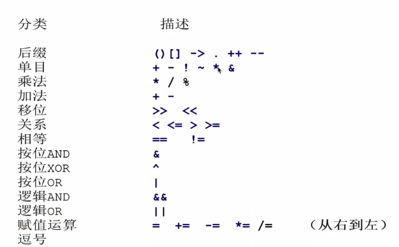


### 10.输入输出函数

```go
package main

import "fmt"

func main() {
	// 输出函数
	// 1. Print 和 Println
	var name, age = "Nash", 22
	fmt.Println("hello world")
	fmt.Println(name)
	fmt.Println(age)
	fmt.Println("姓名：", name, "年龄：", age)

	//不换行
	fmt.Print(name)
	fmt.Print(age)
	fmt.Print("\n")

	// Printf : 标准化输出
	var isMarried = false
	fmt.Printf("姓名：%s，年龄：%d ，婚否：%t", name, age, isMarried)

	fmt.Print("\n")
	// Sprintf: 可以返回一个字符串
	var s = fmt.Sprintf("姓名：%s，年龄：%d ，婚否：%t", name, age, isMarried)
	fmt.Println(s)

	fmt.Println("---------------------------------------")

	// 输出函数 IO函数
	// fmt.Scan

	var name1 string
	var age1 int
	fmt.Println("请输入姓名和年龄，用空格分割：")
	scan, err := fmt.Scan(&name1, &age1)
	if err != nil {
		return
	} // 等待用户在命令行输入一个值
	fmt.Println("scan", scan)
	fmt.Println("姓名：", name1)
	fmt.Println("年龄：", age1)
	fmt.Println("end")

	var a, b int
	fmt.Println("请按指定格式输入：")
	fmt.Scanf("%d+%d", &a, &b)
	fmt.Println(a + b)
}
```


### 11.流程控制语句

```go
package main

import "fmt"

func main() {
	// 分支语句

	// 1. 单分支语句
	var name = "root1"

	if name == "root" {
		// if 为真执行的代码块
		fmt.Println("姓名匹配成功")
	}

	// 2. 双分支语句
	/*	var age int
		fmt.Println("请输入您的年龄：")
		fmt.Scan(&age)
		if age >= 18 {
			// 表达式为真执行语句
			fmt.Println("恭喜")
		} else {
			// 表达式为假执行语句
			fmt.Println("很遗憾")
		}
	*/
	// 3. 多分支语句
	var score int
	fmt.Println("请输入你的成绩：")
	fmt.Scan(&score)

	if score < 0 || score > 100 {
		fmt.Println("输入的成绩不合法")
	} else if score > 90 {
		fmt.Println("成绩优秀")
	} else if score > 60 {
		fmt.Println("成绩良好")
	} else {
		fmt.Println("不及格")
	}

	// switch 语句进行分支判断，switch值判断
	var week int
	fmt.Println("请输入星期的数字：")
	fmt.Scan(&week)

	switch week {
	case 0:
		fmt.Println("星期日")
	case 1:
		fmt.Println("星期一")
	case 2:
		fmt.Println("星期二")
	case 3:
		fmt.Println("星期三")
	case 4:
		fmt.Println("星期四")
	case 5:
		fmt.Println("星期五")
	case 6:
		fmt.Println("星期六")
	}
}
```

### 12.循环语句

```go
package main

import "fmt"

func main() {
	/*
	   for 表达式 {
	      //循环语句
	   }
	*/
	var count = 0
	for count < 10 {
		fmt.Println(count)
		count++
	}

	for count > 0 {
		fmt.Println(count)
		count--
	}

	// 三要素for循环
	/*
	   var count = 0  //初始语句
	   for count < 10 { // 条件表达式
	       fmt.Println(count)
	       count++ //步进语句
	   }
	*/

	/*
	   for num := 0; num < 10; num++ {
	     // 循环语句
	     fmt.Println(num)
	   }
	*/

	// 基于循环  1+2+3+4+...+100 ?

	var total = 0
	for num := 1; num <= 100; num++ {
		total += num
	}
	fmt.Println("total", total)
}
```

### 13.循环语句和分支语句之间的嵌套

```go
package main

import "fmt"

func main() {

	// 循环语句中嵌套分支语句
	for num := 1; num <= 100; num++ {
		if num%2 == 0 {
			fmt.Println(num)
		}
	}

	// 分支语句中嵌套循环语句
	var count int
	fmt.Println("请输入一个正整数：")
	fmt.Scan(&count)

	if count > 100 {
		// 从小到大打印 1 - num
		for i := 1; i < count; i++ {
			fmt.Println(i)
		}
	} else {
		// 从大到小打印num - 1
		for i := count; i > 0; i-- {
			fmt.Println(i)
		}
	}
}
```

### 14.for循环作用域

```go
package main

import "fmt"

func foo() {
	var y = 100
	fmt.Println(y)
}

func main() {

	var x = 10
	fmt.Println(x)

	for i := 0; i < 10; i++ {
		fmt.Println(i)

		fmt.Println(x) //内部可以拿到外部的 x
	}
	//fmt.Println(i)   //拿不到 i
}
```

### 15.退出循环

```go
package main

import "fmt"

func main() {
	for i := 0; i < 10; i++ {

		if i == 3 {
			continue //退出当次循环
		}

		if i == 6 {
			break //退出循环
		}

		fmt.Println(i)
	}
}
```

## 三.重要数据类型

### 1.指针类型

```go
package main

import (
	"fmt"
	"reflect"
)

func main() {
	// &变量 ： 获取变量地址
	var x = 10
	fmt.Printf("赋值之前x的对应地址%p\n", &x)
	x = 100
	fmt.Printf("赋值之后x的对应地址%p\n", &x)

	var y string
	y = "hello"
	fmt.Println("y", y)

	var p *int // p 是一个整型指针类型
	p = &x     //  var p = &x
	fmt.Println("p", p)

	// *指针变量：通过取值操作 获取地址存的值
	fmt.Println("p这个地址里的值:", *p, ",类型：", reflect.TypeOf(*p))
	*p = 1000
	fmt.Println(x)

	/*
		var a = 1
		var b = a
		b = 100 // 改了b 不会影响 a
		fmt.Println(a, b)
	*/

	var a = 1
	var b = &a
	var c *int
	c = b

	*b = 100 //  a  *b  *c 值相同
	fmt.Println(a)
	fmt.Println(*b)
	fmt.Println(*c)

	// 案例1
	var a1 = 100
	var b1 = &a1    // a1的地址
	var c1 = &b1    // b1的地址
	**c1 = 200      // *c1 拿到 b1的地址里存的值 即 a1 的地址 **c1拿到 a1地址里的值 然后取修改为 200
	fmt.Println(a1) // 200

	// 案例2
	p1 := 1
	p2 := &p1
	*p2++
	fmt.Println(p1)  //2
	fmt.Println(*p2) //2
}
```

### 2.new函数

```go
package main

import "fmt"

func main() {
    // 基本数据类型 （整型，浮点型，字符串，布尔类型）范围属于值类型
    // 值类型特点，声明未赋值之前存在一个默认值（zero value）
    var x int
    fmt.Println(x)

    var name string
    fmt.Println(name)

    // 指针类型属于引用类型，包括切片，map，channel都是引用类型
    // 引用类型当声明未赋值之前是没有开辟空间的，即没有默认值
    var p *int
    p = new(int) // 用new 函数开辟一个空间

    *p = 10
    fmt.Println(p)
}
```

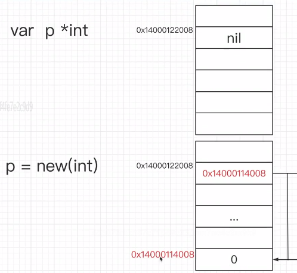

### 3.数组

```go
package main

import "fmt"

func main() {
	// 1. 先声明再赋值
	// 数组的声明
	// 数组必须限制长度
	var arr [3]int
	fmt.Println(arr)

	// 索引赋值
	arr[0] = 10
	fmt.Println(arr)

	// 2.数组的声明并赋值
	var names = [3]string{"Nash", "Bob", "Mike"}
	fmt.Println(names) // [Nash Bob Mike]
	var ages = [3]int{22, 23, 24}
	fmt.Println(ages)

	// 3.省略长度赋值  使用 ... 代替
	var fruits = [...]string{"apple", "peach", "pear"}
	fmt.Println(fruits)
}
```

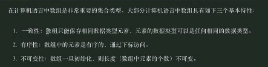

### 4.切片

切片是一个动态数组，因为数组的长度是固定的，所以操作起来很不方便。因此在开发中数组并不常用，切片类型才是大量使用的

```go
package main

import (
	"fmt"
	"reflect"
)

func main() {
	// 构建切片方式一：通过数组切片操作获取切片对象
	var arr = [3]string{"rain", "eric", "alvin"}
	fmt.Println(arr, reflect.TypeOf(arr)) //[rain eric alvin] [3]string

	s1 := arr[0:2]
	fmt.Println(s1, reflect.TypeOf(s1)) //[rain eric] []string

	s2 := arr[1:]
	fmt.Println(s2, reflect.TypeOf(s2))

	s2[0] = "nash"
	fmt.Println(s1)
	fmt.Println(arr)

	// 切片是对数组的引用
	var a = [5]int{1, 2, 3, 4, 5}
	var slice = a[:] // slice 空间里存 起始地址 长度 容量
	fmt.Println(slice)
	newSlice := slice[1:3]
	fmt.Println(newSlice) //  [2,3]

	// 构建切片方式二：直接声明切片
	// 长度 len：切片后元素个数
	// 容量 cap：第一个元素开始数，到其底层数组元素末尾的个数
	var q = []int{10, 11, 12, 13, 14}
	fmt.Println(q)

	q1 := q[1:4]
	fmt.Println(len(q1), cap(q1))

	q2 := q[3:]
	fmt.Println(len(q2), cap(q2))

	q3 := q1[1:3]
	fmt.Println(len(q3), cap(q3))

	// 练习
	test()
}

func test() {
	// 练习1
	s1 := []int{1, 2, 3}
	s2 := s1[1:]
	s2[1] = 4
	fmt.Println(s1) // [1,2,4]

	// 练习2
	var a = []int{1, 2, 3} // a 空间里存 起始地址 长度 容量
	b := a                 // 将 a 的值赋给 b 所以 b 里也存切片的 起始地址 长度 容量
	a[0] = 100
	fmt.Println(b) //[100,2,3]
}
```


### 5.make函数

```go
package main

import "fmt"

func main() {

	//var s []int
	//s[0] = 1 // 直接修改会报错 因为切片 s 未初始化

	//初始化创建空间
	var s = make([]int, 5, 10)
	fmt.Println(len(s), cap(s))
	fmt.Println(s)
	s[0] = 100
	fmt.Println(s)

	// 练习
	test()
}

func test() {
	a := make([]int, 5)
	b := a[0:3]
	a[0] = 100
	fmt.Println(a) // [100,0,0,0,0]
	fmt.Println(b) // [100,0,0]
}
```

### 6.append

```
package main

import (
	"fmt"
)

func main() {
	var s []int
	s1 := append(s, 1)
	fmt.Println(s1)

	s2 := append(s1, 2, 3, 4)
	fmt.Println(s2)

	var t = []int{5, 6, 7}
	s3 := append(s2, t...) // t... 能将t内的元素取出来
	fmt.Println(s3)        // [1,2,3,4,5,6,7]

	var s4 = make([]int, 3, 10)
	s5 := append(s4, 100)
	fmt.Println(s5) // [0,0,0,100]
}
```

### 7.append原理

```go
package main

import "fmt"

func main() {
	a := []int{11, 22, 33}
	fmt.Println(len(a), cap(a)) // 3, 3

	c := append(a, 44) // 由于 切片 a 容量是3且长度是3已经满了，进行append会开辟一个新空间，并对容量进行两倍扩容（将切片a容量扩大到原来的两倍）
	a[0] = 100
	fmt.Println(a)              // [100,22,33]
	fmt.Println(len(a), cap(a)) //3,3
	fmt.Println(c)              // [11,22,33,44]
	fmt.Println(len(c), cap(c)) //4,6

	// 容量够的情况
	p := make([]int, 3, 10)
	fmt.Println(p) // [0,0,0]
	q := append(p, 11, 12)
	fmt.Println(p) //[0,0,0]
	fmt.Println(q) //[0,0,0,11,12]
	p[0] = 100
	fmt.Println(p) //[100,0,0]
	fmt.Println(q) //[100,0,0,11,12]

	fmt.Println("-------------------------------------------")
	//
	arr := [4]int{10, 20, 30, 40}
	s1 := arr[0:2] // [10,20]
	s2 := s1       // [10,20]
	s3 := append(append(append(s1, 1), 2), 3)
	//  append(append([10,20,1], 2), 3)
	// 	append([10,20,1,2], 3)
	//  [10,20,1,2,3]
	s1[0] = 1000
	fmt.Println(s1)  //[1000,20]
	fmt.Println(s2)  //[1000,20]
	fmt.Println(s3)  //[10,20,1,2,3]
	fmt.Println(arr) //[1000,20,1,2]
}
```

### 8.切片的删除插入操作

```go
package main

import "fmt"

func main() {
	// 插入
	var a = []int{1, 2, 3}

	// 在切片 a 最前面插入 0
	a = append([]int{0}, a...)

	fmt.Println(a)
	// 在切片 a 前面插入一个切片
	a = append([]int{-3, -2, -1}, a...)
	fmt.Println(a)

	// 在切片 b 下标 index 后面插入元素
	var b = []int{1, 2, 3, 4, 5}
	var index = 2

	b = append(b[:index], append([]int{7, 8, 9}, b[index:]...)...)
	fmt.Println(b)

	// 删除元素
	var c = []int{1, 2, 3, 4, 5}
	var cIndex = 2
	c = append(c[:cIndex], c[cIndex+1:]...)
	fmt.Println(c)
}
```

### 9.切片的扩容

```go
package main

import "fmt"

func main() {
	//var s = []int{1, 2, 3}
	//s[0] = 100 // 已经对切片 s 声明并初始化 所以可修改 s[0]

	//var s []int
	//s[0] = 100 //不可赋值 前面只是对 s 声明 未开辟底层数组

	//var s = make([]int, 5, 10)
	//s[0] = 100 //可修改

	var emps = make([]string, 3, 5)
	emps[0] = "张三"
	emps[1] = "李四"
	emps[2] = "王五"
	fmt.Println(emps) //[张三 李四 王五]
	emps2 := append(emps, "rain")
	fmt.Println(emps2) //[张三 李四 王五 rain]
	emps3 := append(emps2, "eric")
	fmt.Println(emps3) //[张三 李四 王五 rain eric]
	fmt.Println(emps2) //[张三 李四 王五 rain]

	//容量不够时发生二倍扩容
	emps4 := append(emps3, "nash")
	fmt.Println(emps4)                  //[张三 李四 王五 rain eric nash]
	fmt.Println(len(emps4), cap(emps4)) // 6 10

	fmt.Println("-------------------------------------")

	var s = [3]int{1, 2, 3}
	s1 := s[:]
	s2 := append(s1, 4)
	fmt.Println(s)  //[1 2 3]
	fmt.Println(s1) //[1 2 3]
	fmt.Println(s2) //[1 2 3 4]
}
```

### 10.初始map

```go
package main

import (
	"fmt"
	"reflect"
)

func main() {
	/*
		var map_name map[key_type]value_type
		map_name 	为 map 的变量名
		key_type 	为键类型
		value_type	为键对应的值类型
	*/
	var stus map[string]string
	fmt.Println(stus, reflect.TypeOf(stus)) //map[] map[string]string

	// 声明并初始化

	var students = map[string]string{
		"name": "Nash",
		"age":  "12",
	}
	fmt.Println(students)

	fmt.Println(students["name"])
	fmt.Println(students["age"])

	fmt.Println("len", len(students))

	//写入一个 key-value
	students["gender"] = "0"
	fmt.Println(students["gender"])

	//修改一个key-value
	students["name"] = "Bob"
	fmt.Println(students["name"])

	//删除一个 key-value
	delete(students, "gender")
	fmt.Println(students)

	//基于 make 函数声明初始化
	//var students02 map[string]string
	//students02["name"] = "Bob"  // 会报错 还没有空间

	var students02 = make(map[string]string)
	students02["name"] = "Bob"
	fmt.Println(students02)

	// 要想让值有更多类型 需要使用 interface
	var students03 = make(map[string]interface{})
	students03["name"] = "Ken"
	students03["age"] = 30
	fmt.Println(students03)
}
```

### 11.map的遍历

```go
package main

import "fmt"

func main() {
	// 遍历 map 对象
	var s = map[string]string{
		"name": "Bob",
		"age":  "20",
	}

	for k, v := range s {
		fmt.Println(k)
		fmt.Println(v)
	}

	var noSortMap = map[int]int{
		1: 1,
		2: 2,
		3: 3,
		4: 4,
		5: 5,
		6: 6,
	}

	for k, v := range noSortMap {
		fmt.Println(k, v) //打印出来的顺序是无序的
	}
}
```

### 12.map扩展

```go
package main

import "fmt"

func main() {
    // map 嵌套 slice
    var data = make(map[string][]string)
    data["ZJ"] = []string{"杭州", "温州", "嘉兴"}
    data["BJ"] = []string{"朝阳", "海定", "昌平"}
    fmt.Println(data)

    // 查询 浙江的第二个城市
    fmt.Println(data["ZJ"][1])

    fmt.Println("---------------------------------------")

    // 遍历每一个省份以及对应的城市名
    for proStr, citys := range data {
       fmt.Println(proStr)
       for i, v := range citys {
          fmt.Printf("%d.%s", i, v)
       }
       fmt.Println("\n")
    }
}
```

### 13.map练习

```go
package main

import (
	"fmt"
	"strconv"
)

func main() {
	test01()
	test02()
}

func test01() {
	fmt.Println("test01-----------------------------------")
	//map 嵌套 map
	stu01 := map[string]string{
		"name": "Bob",
		"age":  "22",
	}
	stu02 := map[string]string{
		"name": "Ken",
		"age":  "23",
	}
	stu03 := map[string]string{
		"name": "Nash",
		"age":  "24",
	}

	var stus = make(map[int]map[string]string)

	stus[1001] = stu01
	stus[1002] = stu02
	stus[1003] = stu03

	fmt.Println(stus)

	//打印 1002 的学生的 年龄
	fmt.Println(stus[1002]["age"])
	fmt.Println("-----------------------------------")
	//循环打印每个学生的 学号 姓名 年龄
	for stuId, stuInfo := range stus {
		fmt.Println(stuId, stuInfo["name"], stuInfo["age"])
	}
	fmt.Println("-----------------------------------")
}

func test02() {
	fmt.Println("test02-----------------------------------")
	//切片嵌套 map
	//stu01 := map[string]string{
	//	"name": "Bob",
	//	"age":  "22",
	//}
	//stu02 := map[string]string{
	//	"name": "Ken",
	//	"age":  "23",
	//}
	//stu03 := map[string]string{
	//	"name": "Nash",
	//	"age":  "24",
	//}

	//var stus = make([]map[string]string, 3)

	//var stus = []map[string]string{stu01, stu02, stu03}

	var stus = []map[string]string{
		{
			"name": "Bob",
			"age":  "22",
		}, {
			"name": "Ken",
			"age":  "23",
		}, {
			"name": "Nash",
			"age":  "24",
		},
	}

	fmt.Println(stus)

	//打印第二个学生的姓名
	fmt.Println(stus[1]["name"])

	//循环打印每个学生的姓名和年龄
	for _, v := range stus {
		fmt.Println(v["name"], v["age"])
	}

	//添加一个学生
	newMap := map[string]string{"name": "Eric", "age": "30"}
	stus = append(stus, newMap)
	fmt.Println(stus)

	//删除一个学生
	//a = append(a[:index], a[index + 1:]...)

	//stus = append(stus[:1], stus[2:]...)
	//fmt.Println("stus", stus)

	// 删除学生eric的map
	// 查询eric的索引位置
	var deleteIndex = 0
	for index, stuMap := range stus { 
		if stuMap["name"] == "Eric" {
			deleteIndex = index
		}
	}

	stus = append(stus[:deleteIndex], stus[1+deleteIndex:]...)
	fmt.Println("stus", stus)

	// 将姓名为Ken的学生的年龄自加一岁

	for _, stuMap := range stus {
		if stuMap["name"] == "Ken" {
			// 类型转换
			age, _ := strconv.Atoi(stuMap["age"])
			stuMap["age"] = strconv.Itoa(age + 1)
		}
	}
}
```


## 四.函数

### 1.初识函数

```go
package main

import "fmt"

func main() {
	printLing()
}

/*
 函数功能：代码的一种组织形式，实现模块化，避免重复

 声明函数：

 func 函数名(){
	功能代码
 }

 函数调用：

 函数名()

*/

func printLing() {
	fmt.Println("打印菱形")
}
```

### 2.函数参数

```go
package main

import (
	"fmt"
	"reflect"
)

func main() {
	addToN(10) //实参
	printLing(5)

	add(1, 2, 3, 4)
}

func addToN(n int) { //形参
	var ret = 0
	for i := 1; i <= n; i++ {
		ret += i
	}
	fmt.Println(ret)
}

func printLing(n int) {
	for i := 1; i <= n; i++ {
		for k := 1; k <= n-i; k++ {
			fmt.Print(" ")
		}
		for j := 1; j <= 2*i-1; j++ {
			fmt.Print("*")
		}
		fmt.Println()
	}
}

func add(x ...int) {
	fmt.Println(x, reflect.TypeOf(x))
}
```

### 3.返回值的基本使用

```go
package main

import "fmt"

func main() {
	var sum = addToN(5)
	fmt.Println(sum)

	b, user := login("root", "112")
	if b {
		fmt.Println(user)
	}
}

func addToN(n int) int { //形参
	var ret = 0
	for i := 1; i <= n; i++ {
		ret += i
	}
	return ret // 函数的终止语句
}

func login(user, pwd string) (isSuccess bool, userName string) { //多个返回值 也可以给返回值命名
	if user == "root" && pwd == "123" {
		//登录成功
		return true, user
	} else {
		return false, ""
	}
}

func login1(user, pwd string) (isSuccess bool, userName string) { //多个返回值 也可以给返回值命名
	if user == "root" && pwd == "123" {
		//登录成功
		isSuccess = true
		userName = user
	} else {
		isSuccess = false
		userName = ""
	}
	return
}
```

### 4.作用域

```go
package main

import "fmt"

var x = 1

func main() {
	foo()
	fmt.Println(x)
}

func foo() {
	var x int
	x = 10
	fmt.Println(x)

	// if  for 都可以开辟作用域

	for i := 0; i < 3; i++ {
		fmt.Println(i)
	}
}
```

### 5.函数传参的值拷贝

```go
package main

import "fmt"

func main() {
	var x = 1
	foo(x)

	var age = 22
	setAge(age)             //函数内部只是对传入的值进行值拷贝
	fmt.Println("age", age) // 无法影响到外部的age

	setAgeByAddress(&age) //传入age的地址
	fmt.Println("ageA", age)
}

func foo(x int) {
	x = 100
	fmt.Println("foo", x)
}

func setAge(age int) {
	age++
}

//采用地址方式修改
func setAgeByAddress(ageAddress *int) {
	*ageAddress++
}
```

### 6.匿名函数

```go
package main

import (
	"fmt"
	"reflect"
)

/*
	匿名函数
	func(参数列表)(返回参数列表){
		函数体
	}
*/

/*
	Go语言不支持在函数内部声明普通函数，只能声明匿名函数
*/

func main() {
	//var f = func() {
	//	fmt.Println("hello func")
	//}
	//f()
	(func(x, y int) {
		fmt.Println(x + y)
	})(10, 14)

	foo()
}

func foo() {
	var bar func(int, int) int

	bar = func(x, y int) int {
		return 100
	}

	fmt.Println(reflect.TypeOf(bar))
}
```

### 7.高阶函数之函数作为参数

```go
package main

import (
	"fmt"
	"reflect"
)

/*
	一个高阶函数应该具备下面至少一个特点：
		将一个或多个函数作为形参
		返回一个函数作为其结果
*/

func foo() {
	fmt.Println("foo")
}

// 将函数作为参数传入
func bar(f func()) {
	//经过判断，执行接收到的函数
	f()
}

func main() {
	fmt.Println(foo, reflect.TypeOf(foo))

	bar(foo)
}
```

### 8.高阶函数的应用

```go
package main

import (
	"fmt"
	"time"
)

func foo() {
	fmt.Println("foo功能开始")
	time.Sleep(time.Second * 2) //模拟程序运行了2s
	fmt.Println("foo功能结束")
}

func bar() {
	fmt.Println("bar功能开始")
	time.Sleep(time.Second * 3) //模拟程序运行了3s
	fmt.Println("bar功能结束")
}

func main() {
	// 补充时间戳

	//f1 := time.Now().Unix()
	//fmt.Println(f1, reflect.TypeOf(f1))
	//
	//time.Sleep(time.Second * 3) //模拟程序运行了3s
	//
	//f2 := time.Now().Unix()
	//fmt.Println(f2, reflect.TypeOf(f2))

	foo()
	bar()

	calcFuncCostTime(foo)
}

// 计算函数运行时间
func calcFuncCostTime(f func()) {
	f1 := time.Now().Unix()
	f()
	f2 := time.Now().Unix()
	costTime := f2 - f1
	fmt.Printf("该函数运行了%d秒\n", costTime)
}
```

### 9.函数作为返回值

```go
package main

import "fmt"

func foo() func() int {
	// 声明匿名函数
	var inner = func() int {
		fmt.Println("一个新的函数")
		return 100
	}
	return inner
}

func main() {
	var f func() int
	f = foo() //返回inner函数体赋值给f变量
	f()       // 函数调用
}
```

### 10.闭包函数的语法

```go
package main

import "fmt"

//func getCounter() func() int {
//	var i = 0
//	return func() int {
//		i++
//		fmt.Println(i)
//		return i
//	}
//}

func getCounter(i int) func() int {
	return func() int {
		i++
		fmt.Println(i)
		return i
	}
}

func main() {
	//count := getCounter()

	count := getCounter(1)
	count()
	count()
	c := count()
	fmt.Println("c", c)

	count1 := getCounter(10)
	count1()
	count1()
	count1()
}
```

### 11.闭包函数的应用实例

```go
package main

import (
	"fmt"
	"reflect"
	"runtime"
	"time"
)

func foo() {
	time.Sleep(time.Second * 2)
	fmt.Println("foo功能")
}

//不影响函数已有功能 添加计数功能
func getCalledNum(count int, f func()) func() {
	return func() {
		f()
		count++
		funcName := runtime.FuncForPC(reflect.ValueOf(f).Pointer()).Name()
		fmt.Printf("%s函数被调用第%d次\n", funcName, count)
	}
}

//不影响函数已有功能 添加计时功能
func getCalledTimer(f func()) func() {
	return func() {
		var timer int64
		start := time.Now().Unix()
		f()
		end := time.Now().Unix()
		timer = end - start
		funcName := runtime.FuncForPC(reflect.ValueOf(f).Pointer()).Name()
		fmt.Printf("%s函数运行了%d秒\n", funcName, timer)
	}
}

func main() {
	calledFoo := getCalledNum(0, foo)
	calledFoo()
	calledFoo()

	calledFooTimer := getCalledTimer(foo)
	calledFooTimer()
}
```

### 12.defer语句

defer语句是go语言提供的一种延迟执行机制，可以在函数退出时执行某个语句或函数。

defer语句注册了一个函数调用，这个调用会延迟到defer语句所在的函数执行完毕后执行，所谓执行完毕是指该函数执行了return语句、函数体已执行完最后一条语句或者发生了panic。


当执行defer语句时，函数调用不会马上发生，会先把defer注册的函数及变量拷贝到defer栈中保存，知道函数return前才会执行defer中的函数调用。

**需要额外注意的是**

这一拷贝拷贝的是那一刻函数的值和参数的值，注册之后再修改函数值或参数时，不会生效

```go
package main

import (
	"fmt"
	"os"
)

func test01() {
	fmt.Println("test01")
	defer fmt.Println("test02")
	fmt.Println("test03")

	/*
		打印结果：
		test01
		test03
		test02
	*/
}

func test02() {
	f, err := os.Open("test.txt")
	if err != nil {
		fmt.Println("打开文件出错")
		return
	}
	defer f.Close() // 关闭文件  延迟注册关闭文件操作 保证文件一定关闭
	// 各种文件操作
}

func test03() {
	fmt.Println("test001")
	defer fmt.Println("test002")
	fmt.Println("test003")
	defer fmt.Println("test004")
	fmt.Println("test005")

	/*
			打印结果：
			test001
			test003
			test005
			test004
			test002

			执行顺序：
		    defer 后进先出 先注册的后执行
	*/
}

func test04() {
	foo := func() {
		fmt.Println("foo1")
	}
	defer foo()

	foo = func() {
		fmt.Println("foo2")
	}
}

func test05() {
	x := 10
	defer func(a int) {
		fmt.Println("test05", a)
	}(x)

	x++
}

func test06() {
	x := 10
	defer func() {
		fmt.Println("test06", x)
	}()
	x++
}

func main() {
	test01()
	fmt.Println("-----------------------------------")
	test03()
	fmt.Println("-----------------------------------")
	test04()
	fmt.Println("-----------------------------------")
	test05()
	fmt.Println("-----------------------------------")
	test06()
}
```

### 13.defer案例

```go
package main

import "fmt"

func f1() int {
	fmt.Println("-------------------f1--------------------")
	i := 5
	defer func() {
		i++
	}()
	return i
}

func f2() *int {
	fmt.Println("-------------------f2--------------------")
	i := 5
	defer func() {
		i++
		fmt.Printf("内%p\n", &i)
	}()

	fmt.Printf("外%p\n", &i)
	return &i ///rval = i的地址 , i = 6 , ret rval
}

func f3() (result int) {
	fmt.Println("-------------------f3--------------------")
	defer func() {
		result++
	}()
	return 5 //reslut = 5;ret result(result 替换了 rval)
}

func f4() (result int) {
	fmt.Println("-------------------f4--------------------")
	defer func() {
		result++
	}()
	return result //reslut = 0;result = 1;ret result
}

func f5() (r int) {
	fmt.Println("-------------------f5--------------------")
	t := 5
	defer func() {
		t = t + 1
	}()
	return t // r = t = 5;ret r
}

func f6() (r int) {
	fmt.Println("-------------------f6--------------------")
	fmt.Println(&r)
	defer func(r int) {
		r = r + 1
		fmt.Println(&r)
	}(r)
	return 5 // r= 5;
}

func f7() (r int) {
	fmt.Println("-------------------f7--------------------")
	defer func(x int) {
		r = x + 1
	}(r)
	return 5 // r = 5; r = 0 + 1 = 1 ;ret r
}

func main() {
	fmt.Println(f1())

	fmt.Printf("f2:%d\n", *f2())

	fmt.Println(f3())

	fmt.Println(f4())

	fmt.Println(f5())

	fmt.Println(f6())

	fmt.Println(f7())
}
```


## 五.文件操作

### 1.字符串与字符

```go
package main

import (
	"fmt"
	"reflect"
)

func main() {

	// uint8 只能存0-255
	var x uint8
	x = 255
	fmt.Println(x)

	//字符
	y := 'a' // 双引号标识字符串，单引号标识字符
	fmt.Println("y", y, reflect.TypeOf(y))

	// byte
	// type byte = int8
	var b byte // byte字节类型：声明字符
	b = 'a'
	fmt.Println("b", b, reflect.TypeOf(b))

	//字符串
	/*
			go语言的string是一种数据类型，这个数据类型占用16字节空间，
			前8字节是一个指针，指向字符串值的地址，
		    后8字节是一个整数，标识字符串的长度
	*/

	// rune类型
	// type rune = int32
	var z rune
	z = '严'
	fmt.Printf("字符’严‘unicode的十进制：%d\n", z)  //20005
	fmt.Printf("字符’严‘unicode的十六进制：%x\n", z) //4e25
	fmt.Printf("字符’严‘unicode的二进制：%b\n", z)  //100111000100101
	// unicode utf8转换

}
```

```text
| Unicode 符号范围(16进制)| UTF-8编码方式(2进制)
| -----------------------|--------------------------------------------------------------
| 0000 0000  - 0000 007F |                                                    0xxx xxxx
| 0000 0000  - 0000 07FF |                                          110x xxxx 10xx xxxx
| 0000 0000  - 0000 FFFF |                                1110 xxxx 10xx xxxx 10xx xxxx
| 0001 0000  - 0010 FFFF |                      1111 0xxx 10xx xxxx 10xx xxxx 10xx xxxx
| 0020 0000  - 03FF FFFF |            1111 10xx 10xx xxxx 10xx xxxx 10xx xxxx 10xx xxxx
| 0400 0000  - 7FFF FFFF |  1111 110x 10xx xxxx 10xx xxxx 10xx xxxx 10xx xxxx 10xx xxxx
```

```text
例子：以汉字"严"为例, 演示如何实现UTF-8编码 - 已知"严"的unicode是4E25(1001110 00100101),
根据上表, 可以发现4E25处在第三行的范围内(0000 0800 - 0000 FFFF),
因此"严"的UTF-8编码需要三个字节, 即格式是 "1110xxxx 10xxxxxx 10xxxxxx".
然后, 从"严"的最后一个二进制位开始, 依次从后向前填入格式中的x, 多出的位补0.
这样就得到了, "严"的UTF-8编码是 "11100100 10111000 10100101", 转换成十六进制就是E4B8A5.
```

```go
	var s = "严abc"
	fmt.Println(s, len(s)) //len 字节

	for i := 0; i < len(s); i++ {
		fmt.Println(s[i])
	}
	/*
		228
		184
		165
		97
		98
		99
		前三个编码代表’严‘，后面三个代表abc
	*/

	for i, v := range s {
		fmt.Println(i, v)
	}
	/*
		0 20005
		3 97
		4 98
		5 99
	*/
	// 通过长度遍历 按照字节遍历，按照range遍历 按照字符遍历
```

### 2.字节串与字符串之间的转换

```go
package main

import "fmt"

func main() {
	var msg = "嗨abc"

	// 字符串转换成字节串
	fmt.Println([]byte(msg)) //[229 151 168 97 98 99]

	fmt.Println([]rune(msg)) //[21992 97 98 99]

	// 字节串转换成字符串
	info1 := []byte(msg)
	info2 := []byte{229, 151, 168, 97, 98, 99}

	fmt.Println("info1", info1)
	fmt.Println("info2", info2)
	fmt.Println("info1Str", string(info1))
	fmt.Println("info2Str", string(info2))
}
```

### 3.文件读操作

```go
package main

import (
	"bufio"
	"fmt"
	"io"
	"io/ioutil"
	"os"
)

// （1）按字节读取
func readByBytes(file *os.File) {
	data := make([]byte, 9)
	file.Read(data)
	fmt.Println(data)
}

// （2）按行读数据
func readByLine(file *os.File) {
	reader := bufio.NewReader(file)

	for true {
		//lineContent, _, _ := reader.ReadLine()
		//fmt.Println(string(lineContent))

		lineContent, err := reader.ReadString('\n')
		fmt.Println(lineContent)
		if err == io.EOF {
			break
		}
	}
}

// （3）读取整个文件
func readByFile() {
	content, _ := ioutil.ReadFile("./满江红")
	fmt.Println(string(content))
}

func main() {
	//os.Open()函数能够打开一个文件，返回一个 *File 和一个 err

	//打开文件
	file, err := os.Open("./满江红")
	if err != nil {
		fmt.Println("打开文件失败")
	} else {
		fmt.Println(file)
	}

	//需要在终端 使用命令 go run main.go 启动

	// （1）按字节读取
	//readByBytes(file)

	// （2）按行读数据
	//readByLine(file)

	// （3）读取整个文件
	readByFile()
}
```

### 4.文件写操作

```
OpenFile是一个更一般性的文件打开函数，大多数调用者都应用Open或Create代替本函数。它会使用指定的选项（如O_RDONLY等）、指定的模式（如0666等）打开指定名称的文件。
如果操作成功，返回的文件对象可用于I/O；如果出错，错误底层类型是*PathError。
```

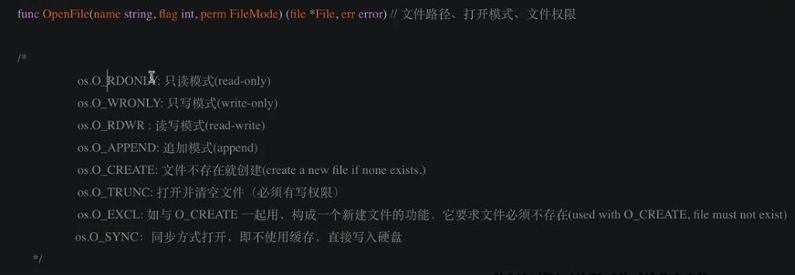


```go
package main

import (
	"bufio"
	"fmt"
	"io/ioutil"
	"os"
)

func main() {
	/*
		OpenFile是一个更一般性的文件打开函数，大多数调用者都应用Open或Create代替本函数。它会使用指定的选项（如O_RDONLY等）、指定的模式（如0666等）打开指定名称的文件。
		如果操作成功，返回的文件对象可用于I/O；如果出错，错误底层类型是*PathError。
	*/

	file, err := os.OpenFile("满江红", os.O_WRONLY|os.O_CREATE|os.O_APPEND, 0666)
	if err != nil {
		fmt.Println("打开文件失败")
	}
	fmt.Println("file:", file)

	// (1) 按字符串或者字节写操作
	file.WriteString("怒发冲冠，凭栏处、潇潇雨歇。抬望眼、仰天长啸，壮怀激烈。\n")

	file.Write([]byte("三十功名尘与土，八千里路云和月。\n"))

	// (2) 缓存写
	// 创建一个写入器（缓存区）
	writer := bufio.NewWriter(file)
	// 将数据写入缓存
	writer.WriteString("莫等闲，白了少年头，空悲切。\n")
	// 将缓存中的内容写入文件
	writer.Flush()

	// （3）写整个文件
	str := "靖康耻，犹未雪；臣子恨，何时灭？\n"
	ioutil.WriteFile("满江红1", []byte(str), 0666)
}
```

## 六.结构体

在Go语言中，结构体承担着面向对象语言中类的作用。Go语言中，结构体本身仅用来定义属性。还可以通过接收器函数来定义方法，
使用内嵌结构体来定义继承，这样使用结构体相关操作Go语言就可以实现OOP面向对象编程

### 1.结构体声明

GO语言通过 type 和 struct 关键字声明结构体

```go
type 类型名 struct{ //标识结构体的类型名，在同一个包内不能重复
    字段1 字段1类型  //字段名必须唯一
    字段2 字段2类型
    ...
}
```

```go
package main

// 类型包含属性和方法
// 对象是类型实例化的结果

// 声明结构体  关键字  type ... struct
type Student struct {
	sid    int
	name   string
	age    int
	course []string
}

type Person struct {
	name   string
	gender string
	age    int8
	addr   string
}

func main() {

}
```

### 2.结构体实例化

```go
package main

import (
	"fmt"
)

type Student struct {
	sid    int
	name   string
	age    int
	course []string
}

func initSid(p *Student) {
	(*p).sid = 100
}

func main() {
	// 实例化方式1
	var Nash Student
	Nash.sid = 1
	Nash.name = "Nash"
	Nash.age = 18

	fmt.Println(Nash.name)

	Nash.course = make([]string, 3)
	Nash.course[0] = "Go"

	fmt.Println(Nash)

	//实例化方式2

	var Ken = Student{
		sid:    2,
		name:   "Ken",
		age:    18,
		course: []string{"Go", "Python"},
	}
	fmt.Println(Ken)

	//实例化方式3
	var Jack = Student{3, "Jack", 18, []string{"Go", "Python"}}
	fmt.Println(Jack)

	//实例化方式4
	var Tom = Ken //值拷贝
	Tom.age = 32
	Tom.name = "Tom"
	fmt.Println(Ken)
	fmt.Println(Tom)

	initSid(&Tom)

	fmt.Println(Tom)

	//实例化方式5
	var p = new(Student)
	p.name = "p"
	fmt.Println(p) //&{0 p 0 []}
}
```


### 3.结构体模拟构造函数

```go
package main

import "fmt"

type Student struct {
	sid    int
	name   string
	age    int
	course []string
}

func NewStudent(sid int, name string, age int, course []string) Student {
	return Student{
		sid:    sid,
		name:   name,
		age:    age,
		course: course,
	}
}

func main() {
	s1 := NewStudent(1001, "Bob", 11, []string{"GO"})
	fmt.Println(s1)
}
```

### 4.结构体的方法接收器

```go
package main

import "fmt"

type Student struct {
	sid    int
	name   string
	age    int
	course []string
}

func NewStudent(sid int, name string, age int, course []string) Student {
	return Student{
		sid:    sid,
		name:   name,
		age:    age,
		course: course,
	}
}

// Student类型的方法接收器
// 在方法名前加括号，括号内写结构体的名称，表示这个方法和这个结构体绑定
func (s Student) read(bookName string) {
	fmt.Printf("学生正在读%s书\n", bookName)
}

func (s Student) learn() {
	fmt.Printf("学生%s正在学习\n", s.name)
}

func main() {
	s1 := NewStudent(1001, "Bob", 11, []string{"GO"})
	s1.read("数学")
	s1.learn()
}
```

### 5.结构体的方法接收器的指针变量

```go
package main

import "fmt"

type Player struct {
	Name        string
	HealthPoint int
	Level       int
	NowPosition []int
	Prop        []string
}

func NewPlayer(name string, hp int, level int, np []int, prop []string) Player {
	return Player{
		Name:        name,
		HealthPoint: hp,
		Level:       level,
		NowPosition: np,
		Prop:        prop,
	}
}

func (p *Player) attack() {
	fmt.Printf("%s正在攻击\n", p.Name)
}

func (p *Player) attacked() {
	fmt.Printf("%s被攻击\n", p.Name)
	p.HealthPoint = p.HealthPoint - 10
}

func (p *Player) buyProp(propName string) {
	fmt.Printf("%s购买了%s\n", p.Name, propName)
	p.Prop = append(p.Prop, propName)
}

func main() {
	p1 := NewPlayer("Nash", 100, 1, []int{1, 1}, []string{"木剑"})
	p1.attack()
	p1.attacked()

	fmt.Println("p1的血槽值", p1.HealthPoint)

	p1.buyProp("药水")
	fmt.Println(p1)
}
```

### 6.结构体的匿名字段

```go
package main

import "fmt"

type Addr struct {
	province string
	city     string
	country  string
}

type Student struct {
	string //匿名字段  相当于 string  string
	name   string
	age    int
	Addr   //匿名字段
}

func main() {
	s := Student{"string", "Nash", 18, Addr{"广东", "深圳", "南山区"}}
	fmt.Println(s)

	fmt.Println(s.Addr.province)
}
```

### 7.结构体的继承

```go
package main

import "fmt"

// Animal 类型
type Animal struct {
	Name string
}

func (a Animal) eat() {
	fmt.Printf("%s is eating\n", a.Name)
}

// Dog 类型
type Dog struct {
	Kind string
	Animal
}

func (d Dog) bark() {
	fmt.Printf("%s is barking\n", d.Name)
}

// Cat 类型
type Cat struct {
	Kind string
	Animal
}

func main() {
	d1 := Dog{
		Kind: "哈士奇",
		Animal: Animal{
			Name: "旺财",
		},
	}
	d1.eat()
	d1.bark()

	c1 := Cat{
		Kind: "波斯猫",
		Animal: Animal{
			Name: "小花",
		},
	}
	c1.eat()
}
```


### 8.JSON

序列化最重要的就是json序列化

JSON（javaScript Object Notation，JS对象标记）是一种轻量级的数据交换格式。它基于ECMAScript的一个子集，采用完全独立于编程语言的文本格式来存储和表示数据。简洁和清晰的层次结构使得JSON成为理想的数据交换语言。易于人阅读和编写，同时也易于机器解析和生成，并有效的提升网络传输效率。

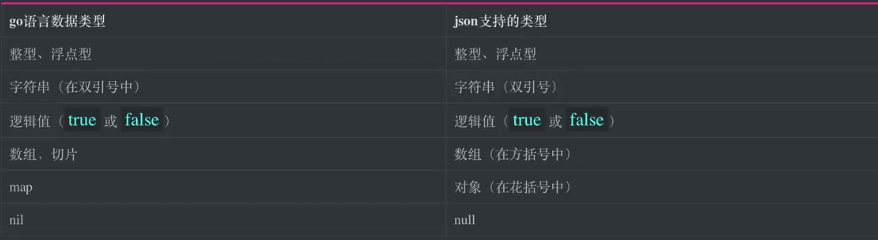

```go
package main

import (
	"encoding/json"
	"fmt"
	"io/ioutil"
)

func main() {
	var s = []int{1, 2, 3, 4}

	var m = map[string]string{
		"name": "Nash",
		"age":  "18",
	}

	// json序列化
	//data, _ := json.Marshal(s)
	data, _ := json.Marshal(m)

	fmt.Println("s", s)

	fmt.Println(string(data))

	fmt.Printf("%#v\n", string(data))

	ioutil.WriteFile("data.json", data, 0666)

	// 反序列化
	readData, _ := ioutil.ReadFile("data.json")
	fmt.Println("readData", readData)
	fmt.Println("readDataStr", string(readData))

	readDataTrans := make(map[string]string)

	json.Unmarshal(readData, &readDataTrans)

	fmt.Println("readDataTrans[name]", readDataTrans["name"])
}
```

### 9.结构体的JSON序列化

```go
package main

import (
	"encoding/json"
	"fmt"
)

type Addr struct {
	Province string
	City     string
}

type Stu struct {
	Name string `json:"name"` //结构体的标签
	Age  int    `json:"-"`    //表示不参与序列化
	Addr Addr

	//gender  string //首字母小写的字段不会被序列化
}

func main() {
	var nashMap = map[string]interface{}{
		"name": "Nash",
		"age":  18,
		"addr": map[string]string{
			"province": "浙江",
			"city":     "杭州",
		},
	}

	var nashStruct = Stu{Name: "Nash", Age: 18, Addr: Addr{Province: "浙江", City: "杭州"}}

	jsonNashMap, _ := json.Marshal(nashMap)
	fmt.Println(string(jsonNashMap))

	jsonNashStruct, _ := json.Marshal(nashStruct)
	fmt.Println(string(jsonNashStruct))

	// 反序列化
	var nashMapUnJson map[string]interface{}
	json.Unmarshal(jsonNashMap, &nashMapUnJson)
	fmt.Println("nashMapUnJson", nashMapUnJson)

	var nashStructUnJson Stu
	json.Unmarshal(jsonNashStruct, &nashStructUnJson)
	fmt.Println("nashStructUnJson", nashStructUnJson)

	fmt.Println("--------------------------------------")

	var s1 = Stu{Name: "S1", Age: 18, Addr: Addr{Province: "浙江", City: "杭州"}}
	var s2 = Stu{Name: "S2", Age: 18, Addr: Addr{Province: "浙江", City: "杭州"}}
	var s3 = Stu{Name: "S3", Age: 18, Addr: Addr{Province: "浙江", City: "杭州"}}

	var data = []Stu{s1, s2, s3}

	jsonData, _ := json.Marshal(data)

	fmt.Println(string(jsonData))

	var dataUnJson []Stu
	json.Unmarshal(jsonData, &dataUnJson)
	fmt.Println(dataUnJson)
}
```

## 七.包管理

Go语言是使用包来组织源代码的。包（package）是多个Go源码的集合，是一种高级的代码复用方案。Go语言中为我们提供了很多内置包，如fmt、os、io等。任何源代码文件必须属于某个包，同时源码文件的第一行有效代码必须是package packageName 语句，通过该语句声明所在的包。

Go语言的包借助了目录树的组织形式，一般包的名称就是其源文件所在目录的名称，虽然Go语言没有强制要求必须和其所在的目录名同名，但还是建议包和所在目录同名，这样结构更清晰。


### gopath 模式

新建

mysite/main.go

```go
package main // 声明包名

import (
	"fmt"
	"learn/day07/packManage/mysite/api"
) // 导入依赖包

func main() {
	api.RestfulApi()
	api.RpcApi()

	fmt.Scanln()
}
```


新建

mysite/api/restful.go

```go
package api

import (
	"fmt"
	"learn/day07/packManage/mysite/db"
)

func RestfulApi() {
	db.HandleMySql()

	fmt.Println("操作restfulApi接口")
}
```

mysite/api/rpc.go

```go
package api

import (
	"fmt"
	"learn/day07/packManage/mysite/db"
)

func RpcApi() {
	db.HandleRedis()
	fmt.Println("操作rpcApi接口")
}
```


mysite/db/mysql.go

```go
package db

import "fmt"

func HandleMySql() {
	fmt.Println("操作mysql")
}
```


mysite/db/redis.go

```go
package main // 声明包名

//import (
//	"fmt"
//	"learn/day07/packManage/mysite/api"
//) // 导入依赖包

import (
	"fmt"
)

//import A "learn/day07/packManage/mysite/api"  //可以对包起别名
import . "learn/day07/packManage/mysite/api" //也可使用 . 代表导入包内所有函数

func main() {
	RestfulApi()
	RpcApi()

	fmt.Scanln()
}
```


在一个文件内要使用别的文件的方法 通过 import 导入

函数名首字母大写代表可以暴露给外部使用


### gomodule 模式

启用 gomodule

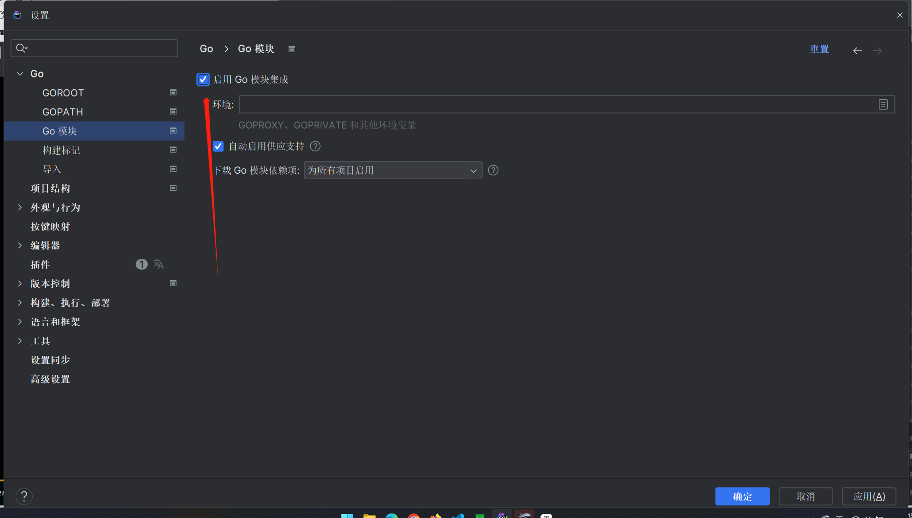


在项目根目录终端 输入  go mod init 会生成文件

go.mod

```go
module mysite

go 1.18
```


然后将原来项目中 导入依赖包的地方修改路径 

如将

```go
import . "learn/day07/packManage/mysite/api"
```

修改为

```
import . "mysite/api" 
```

去除 mysite 前的路径


#### gomod 命令

```go
# 1, Go mod 初始化
go mod init 模块名

# 2, Go mod 下载到本地Cache
go mod download
# 2, Go mod 清理本地Cache
go clean -modcache

# 3, Go mod 编辑go.mod文件：更多go mod查看 `go help mod edit`
go mod edit

# 4, Go mod 打印依赖图
go mod graph

# 5, Go mod 删除错误或者不使用的modules
go mod tidy

# 6, Go mod 生成vendor目录
go mod vendor

# 7, Go mod 验证依赖是否正确
go mod verify

# 8, Go mod 查找依赖
go mod why

# 9, GO mod 更新依赖到最新版本
go get -u github.com/golang/protobuf

# 10, Go mod 更新到指定版本
go get -u github.com/golang/protobuf@指定版本
# 10, Go mod 查看有哪些版本
go list -m -versions github.com/golang/protobuf

# 11, Go mod 替换包源
go mod edit -replace=golang.org/x/crypto@v0.0.0=github.com/golang/crypto@latest
go mod edit -replace=golang.org/x/sys@v0.0.0=github.com/golang/sys@latest

# 12, Go打包给其他包调用
git tag -a v0.0.1 -m "Golang打包给其他包调用" && git push origin v0.0.1
go get -u xxxxxx
```


## 练习--客户关系管理系统

### 切片map版

```go
package main

import (
	"fmt"
	"os"
	"strconv"
)

var customers = []map[string]string{}
var customerID int

func main() {
	for true {
		fmt.Printf("\033[1;30;42m%s\033[0m\n", `
	------------------客户信息管理系统------------------
	1.添加客户                                         
	2.查看客户                                         
	3.更新客户
	4.删除客户
	5.保存
	6.退出
	--------------------------------------------------
`)
		var choice int8

		fmt.Print("请输入您的选择：")
		fmt.Scanln(&choice)

		switch choice {
		case 1:
			// 添加客户
			// 引导用户输入

			//引导用户输入学号和姓名
			fmt.Printf("\033[1;30;42m%s\033[0m\n", `
			------------------添加客户开始------------------
			`)
			var name string
			fmt.Print("请输入客户姓名：")
			fmt.Scan(&name)

			var gender string
			fmt.Print("请输入客户性别：")
			fmt.Scan(&gender)

			var age string
			fmt.Print("请输入客户年龄：")
			fmt.Scan(&age)

			var email string
			fmt.Print("请输入客户邮箱：")
			fmt.Scan(&email)

			customerID++
			var newCustomer = map[string]string{
				"cid":    strconv.Itoa(customerID),
				"name":   name,
				"gender": gender,
				"age":    age,
				"email":  email,
			}
			customers = append(customers, newCustomer)
			fmt.Printf("\033[1;30;42m%s\033[0m\n", `
			------------------添加客户成功------------------
			`)

		case 2:
			// 查看
			fmt.Printf("\033[1;30;42m%s\033[0m\n", `
			------------------客户列表开始------------------
			`)

			for _, customer := range customers {
				fmt.Printf("客户编号：%-6s,姓名：%-8s,性别：%-6s,年龄：%-8s,邮箱：%-8s\n",
					customer["cid"], customer["name"], customer["gender"], customer["age"], customer["email"])
			}

			fmt.Printf("\033[1;30;42m%s\033[0m\n", `
			------------------客户列表结束------------------
			`)

		case 3:
			fmt.Printf("\033[1;30;42m%s\033[0m\n", `
				------------------客户修改开始------------------
				`)
			for true {
				//引导用户输入一个客户编号
				var cid string
				fmt.Print("请输入修改的客户编号：")
				fmt.Scan(&cid)

				// 判断客户是否存在
				var updateIndex int = -1
				for i, customer := range customers {
					if customer["cid"] == cid {
						updateIndex = i
						break
					}
				}
				if updateIndex == -1 {
					fmt.Println("您输入的客户编号不存在")
					continue
				}
				updateCustomer := customers[updateIndex]

				var name string
				fmt.Printf("请输入客户姓名(%s)：", updateCustomer["name"])
				fmt.Scanln(&name)

				var gender string
				fmt.Printf("请输入客户性别(%s)：", updateCustomer["gender"])
				fmt.Scanln(&gender)

				var age string
				fmt.Printf("请输入客户年龄(%s)：", updateCustomer["age"])
				fmt.Scanln(&age)

				var email string
				fmt.Printf("请输入客户邮箱(%s)：", updateCustomer["email"])
				fmt.Scanln(&email)

				if name != "" {
					updateCustomer["name"] = name
				}
				if gender != "" {
					updateCustomer["gender"] = gender
				}
				if age != "" {
					updateCustomer["age"] = age
				}
				if email != "" {
					updateCustomer["email"] = email
				}

				fmt.Printf("\033[1;30;42m%s\033[0m\n", `
				------------------客户修改成功------------------
				`)
				break
			}

		case 4:
			for true {
				//引导用户输入一个客户编号
				var cid string
				fmt.Print("请输入删除的客户编号：")
				fmt.Scan(&cid)
				// 判断客户是否存在
				var deleteIndex int = -1
				for i, customer := range customers {
					if customer["cid"] == cid {
						deleteIndex = i
						break
					}
				}
				if deleteIndex == -1 {
					fmt.Println("您输入的客户编号不存在")
					continue
				}
				customers = append(customers[:deleteIndex], customers[deleteIndex+1:]...)
				fmt.Print("删除成功")
				break
			}

		case 5:
			//保存
			fmt.Println("保存成功")
		case 6:
			//退出
			fmt.Println("退出成功")
			os.Exit(0)
		}
	}
}
```

### 函数结构体版

```go
package main

import (
	"fmt"
	"os"
)

/*

 面向过程 面向对象 对比

 例子
 面向过程：
 1. 将衣服放进洗衣机
 2. 倒入洗衣液
 3. 洗涤
 4. 脱水
 5. 甩干
 6. 晾晒

 面向对象：
 人对象-人类型
 洗衣机-洗衣机类型

 1. 人.将衣服放进洗衣机()
 2. 人.倒入洗衣液()
 3. 洗衣机.洗涤()
 4. 洗衣机.脱水()
 5. 洗衣机.甩干()
 6. 人.晾晒()

*/

type Customer struct {
	cid    int
	name   string
	gender string
	age    int
	email  string
}

type CustomerService struct {
	customers  []Customer
	customerID int
}

//var customers []Customer
//var customerID int

func (cs *CustomerService) addCustomer() {
	// 引导用户输入

	//引导用户输入学号和姓名
	fmt.Printf("\033[1;30;42m%s\033[0m\n", `
			------------------添加客户开始------------------
			`)
	var name string
	fmt.Print("请输入客户姓名：")
	fmt.Scan(&name)

	var gender string
	fmt.Print("请输入客户性别：")
	fmt.Scan(&gender)

	var age int
	fmt.Print("请输入客户年龄：")
	fmt.Scan(&age)

	var email string
	fmt.Print("请输入客户邮箱：")
	fmt.Scan(&email)

	cs.customerID++
	var newCustomer = Customer{
		cid:    cs.customerID,
		name:   name,
		gender: gender,
		age:    age,
		email:  email,
	}
	cs.customers = append(cs.customers, newCustomer)
	fmt.Printf("\033[1;30;42m%s\033[0m\n", `
			------------------添加客户成功------------------
			`)
}

func (cs *CustomerService) listCustomer() {
	fmt.Printf("\033[1;30;42m%s\033[0m\n", `
			------------------客户列表开始------------------
			`)

	for _, customer := range cs.customers {
		fmt.Printf("客户编号：%-6d,姓名：%-8s,性别：%-6s,年龄：%-8d,邮箱：%-8s\n",
			customer.cid, customer.name, customer.gender, customer.age, customer.email)
	}

	fmt.Printf("\033[1;30;42m%s\033[0m\n", `
			------------------客户列表结束------------------
			`)
}

func (cs *CustomerService) updateCustomer() {
	fmt.Printf("\033[1;30;42m%s\033[0m\n", `
				------------------客户修改开始------------------
				`)
	for true {
		//引导用户输入一个客户编号
		var cid int
		fmt.Print("请输入修改的客户编号：")
		fmt.Scan(&cid)

		// 判断客户是否存在
		var updateIndex int = -1
		for i, customer := range cs.customers {
			if customer.cid == cid {
				updateIndex = i
				break
			}
		}
		if updateIndex == -1 {
			fmt.Println("您输入的客户编号不存在")
			continue
		}
		updateCustomer := &cs.customers[updateIndex]

		var name string
		fmt.Printf("请输入客户姓名(%s)：", updateCustomer.name)
		fmt.Scanln(&name)

		var gender string
		fmt.Printf("请输入客户性别(%s)：", updateCustomer.gender)
		fmt.Scanln(&gender)

		var age int
		fmt.Printf("请输入客户年龄(%s)：", updateCustomer.age)
		fmt.Scanln(&age)

		var email string
		fmt.Printf("请输入客户邮箱(%s)：", updateCustomer.email)
		fmt.Scanln(&email)

		if name != "" {
			updateCustomer.name = name
		}
		if gender != "" {
			updateCustomer.gender = gender
		}
		if age != 0 {
			updateCustomer.age = age
		}
		if email != "" {
			updateCustomer.email = email
		}

		fmt.Printf("\033[1;30;42m%s\033[0m\n", `
				------------------客户修改成功------------------
				`)
		break
	}
}

func (cs *CustomerService) deleteCustomer() {

	for true {
		//引导用户输入一个客户编号
		var cid int
		fmt.Print("请输入删除的客户编号：")
		fmt.Scan(&cid)
		// 判断客户是否存在
		var deleteIndex int = -1
		for i, customer := range cs.customers {
			if customer.cid == cid {
				deleteIndex = i
				break
			}
		}
		if deleteIndex == -1 {
			fmt.Println("您输入的客户编号不存在")
			continue
		}
		cs.customers = append(cs.customers[:deleteIndex], cs.customers[deleteIndex+1:]...)
		fmt.Print("删除成功")
		break
	}
}

func main() {
	cs := CustomerService{
		customers:  []Customer{},
		customerID: 0,
	}

	for true {
		fmt.Printf("\033[1;30;42m%s\033[0m\n", `
	------------------客户信息管理系统------------------
	1.添加客户                                         
	2.查看客户                                         
	3.更新客户
	4.删除客户
	5.保存
	6.退出
	--------------------------------------------------
`)
		var choice int8

		fmt.Print("请输入您的选择：")
		fmt.Scanln(&choice)

		switch choice {
		case 1:
			// 添加客户
			cs.addCustomer()
		case 2:
			// 查看
			cs.listCustomer()
		case 3:
			//修改
			cs.updateCustomer()

		case 4:
			//删除
			cs.deleteCustomer()

		case 5:
			//保存
			fmt.Println("保存成功")
		case 6:
			//退出
			fmt.Println("退出成功")
			os.Exit(0)
		}
	}
}
```


### 包管理版

文件目录

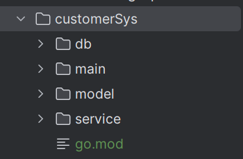


###### customerSys/go.mod

```
module customerSys

go 1.18
```


###### customerSys/main/main.go

```go
package main

import (
	"customerSys/model"
	"customerSys/service"
	"encoding/json"
	"fmt"
	"io/ioutil"
	"os"
)

func main() {

	customersJsonBytes, err := ioutil.ReadFile("db/customer.json")

	var Customers []model.Customer
	var CustomerID int
	if err != nil {
		fmt.Println("err：", err)

		Customers = make([]model.Customer, 0, 10)
		CustomerID = 0
	} else {
		json.Unmarshal(customersJsonBytes, &Customers)
		CustomerID = Customers[len(Customers)-1].Cid
	}

	cs := service.CustomerService{
		Customers:  Customers,
		CustomerID: CustomerID,
	}

	for true {
		fmt.Printf("\033[1;30;42m%s\033[0m\n", `
	------------------客户信息管理系统------------------
	1.添加客户                                         
	2.查看客户                                         
	3.更新客户
	4.删除客户
	5.保存
	6.退出
	--------------------------------------------------
`)
		var choice int8

		fmt.Print("请输入您的选择：")
		fmt.Scanln(&choice)

		switch choice {
		case 1:
			// 添加客户
			cs.AddCustomer()
		case 2:
			// 查看
			cs.ListCustomer()
		case 3:
			//修改
			cs.UpdateCustomer()

		case 4:
			//删除
			cs.DeleteCustomer()

		case 5:
			//保存
			cs.SaveCustomer()
		case 6:
			//退出
			fmt.Println("退出成功")
			os.Exit(0)
		}
	}
}
```


###### customerSys/model/customer.go

```go
package model

type Customer struct {
	Cid    int
	Name   string
	Gender string
	Age    int
	Email  string
}
```

###### customerSys/service/customerService.go

```go
package service

import (
	"customerSys/model"
	"encoding/json"
	"fmt"
	"io/ioutil"
)

type CustomerService struct {
	Customers  []model.Customer
	CustomerID int
}

func (cs *CustomerService) AddCustomer() {
	// 引导用户输入

	//引导用户输入学号和姓名
	fmt.Printf("\033[1;30;42m%s\033[0m\n", `
			------------------添加客户开始------------------
			`)
	var name string
	fmt.Print("请输入客户姓名：")
	fmt.Scan(&name)

	var gender string
	fmt.Print("请输入客户性别：")
	fmt.Scan(&gender)

	var age int
	fmt.Print("请输入客户年龄：")
	fmt.Scan(&age)

	var email string
	fmt.Print("请输入客户邮箱：")
	fmt.Scan(&email)

	cs.CustomerID++
	var newCustomer = model.Customer{
		Cid:    cs.CustomerID,
		Name:   name,
		Gender: gender,
		Age:    age,
		Email:  email,
	}
	cs.Customers = append(cs.Customers, newCustomer)
	fmt.Printf("\033[1;30;42m%s\033[0m\n", `
			------------------添加客户成功------------------
			`)
}

func (cs *CustomerService) ListCustomer() {
	fmt.Printf("\033[1;30;42m%s\033[0m\n", `
			------------------客户列表开始------------------
			`)

	for _, customer := range cs.Customers {
		fmt.Printf("客户编号：%-6d,姓名：%-8s,性别：%-6s,年龄：%-8d,邮箱：%-8s\n",
			customer.Cid, customer.Name, customer.Gender, customer.Age, customer.Email)
	}

	fmt.Printf("\033[1;30;42m%s\033[0m\n", `
			------------------客户列表结束------------------
			`)
}

func (cs *CustomerService) UpdateCustomer() {
	fmt.Printf("\033[1;30;42m%s\033[0m\n", `
				------------------客户修改开始------------------
				`)
	for true {
		//引导用户输入一个客户编号
		var cid int
		fmt.Print("请输入修改的客户编号：")
		fmt.Scan(&cid)

		// 判断客户是否存在
		var updateIndex int = -1
		for i, customer := range cs.Customers {
			if customer.Cid == cid {
				updateIndex = i
				break
			}
		}
		if updateIndex == -1 {
			fmt.Println("您输入的客户编号不存在")
			continue
		}
		updateCustomer := &cs.Customers[updateIndex]

		var name string
		fmt.Printf("请输入客户姓名(%s)：", updateCustomer.Name)
		fmt.Scanln(&name)

		var gender string
		fmt.Printf("请输入客户性别(%s)：", updateCustomer.Gender)
		fmt.Scanln(&gender)

		var age int
		fmt.Printf("请输入客户年龄(%s)：", updateCustomer.Age)
		fmt.Scanln(&age)

		var email string
		fmt.Printf("请输入客户邮箱(%s)：", updateCustomer.Email)
		fmt.Scanln(&email)

		if name != "" {
			updateCustomer.Name = name
		}
		if gender != "" {
			updateCustomer.Gender = gender
		}
		if age != 0 {
			updateCustomer.Age = age
		}
		if email != "" {
			updateCustomer.Email = email
		}

		fmt.Printf("\033[1;30;42m%s\033[0m\n", `
				------------------客户修改成功------------------
				`)
		break
	}
}

func (cs *CustomerService) DeleteCustomer() {

	for true {
		//引导用户输入一个客户编号
		var cid int
		fmt.Print("请输入删除的客户编号：")
		fmt.Scan(&cid)
		// 判断客户是否存在
		var deleteIndex int = -1
		for i, customer := range cs.Customers {
			if customer.Cid == cid {
				deleteIndex = i
				break
			}
		}
		if deleteIndex == -1 {
			fmt.Println("您输入的客户编号不存在")
			continue
		}
		cs.Customers = append(cs.Customers[:deleteIndex], cs.Customers[deleteIndex+1:]...)
		fmt.Print("删除成功")
		break
	}
}

func (cs *CustomerService) SaveCustomer() {
	customersJsonBytes, _ := json.Marshal(cs.Customers)

	err := ioutil.WriteFile("db/customer.json", customersJsonBytes, 0666)

	if err != nil {
		fmt.Println("err：", err)
	}

	fmt.Println("保存成功!")
}
```

###### customerSys/db/customer.json

```json
[{"Cid":1,"Name":"Nash","Gender":"male","Age":22,"Email":"2@qq.com"},{"Cid":2,"Name":"Bob","Gender":"male","Age":44,"Email":"4@qq.com"}]
```

